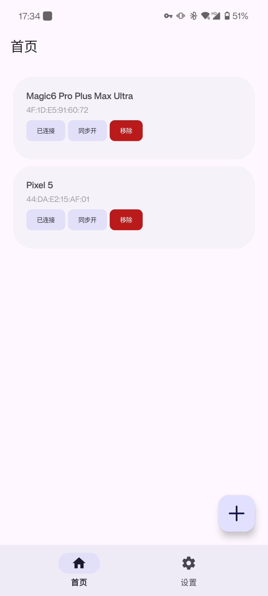
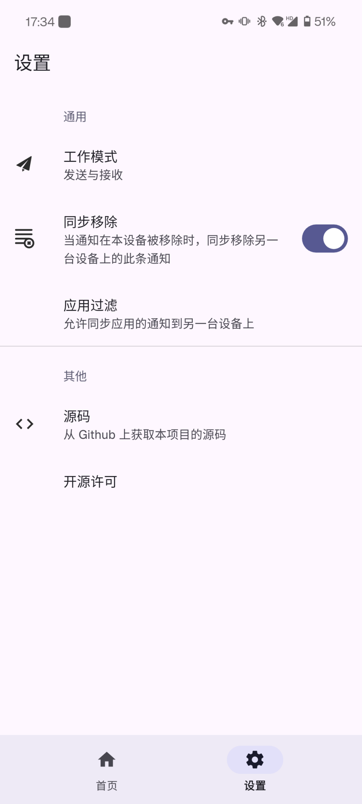

# NotiSync

简体中文 | [English](README_EN.MD)

通过低功耗蓝牙将通知同步到另一台设备上。

## 关于

由于我出门的时候经常带两台手机，有时候另一台放包里，这就导致了有时候会错过一些通知;又或者，用另一台手机接收验证码，但这台手机在稍微远一点的地方懒得去拿（确实有这么懒）。这些场景下可以直接同步两台甚至多台设备的通知。

Q：为什么不用 [SmsForwarder](https://github.com/pppscn/SmsForwarder) 呢？

A：一开始也想用这个，但是还需要联网，开发者大概也不会加入蓝牙的功能（可查看此 [issue](https://github.com/pppscn/SmsForwarder/issues/450)），不然我也懒得的写这玩意。

## 特性

+ 同步发送通知
+ 同步移除通知
+ 连接多台设备
+ 不使用网络，不声明网络权限，可放心隐私问题
+ 通知按应用过滤

## 注意

目前仅相当于一个 demo，很多功能还没完善，也还有一堆 bug，后续我会在日常使用中逐渐修复。

## 星标数量（先不要脸地放上来）

## 截图

|  | |
| -- | -- |