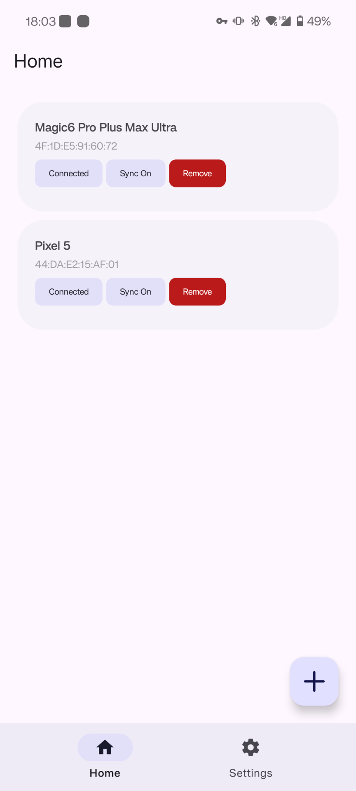
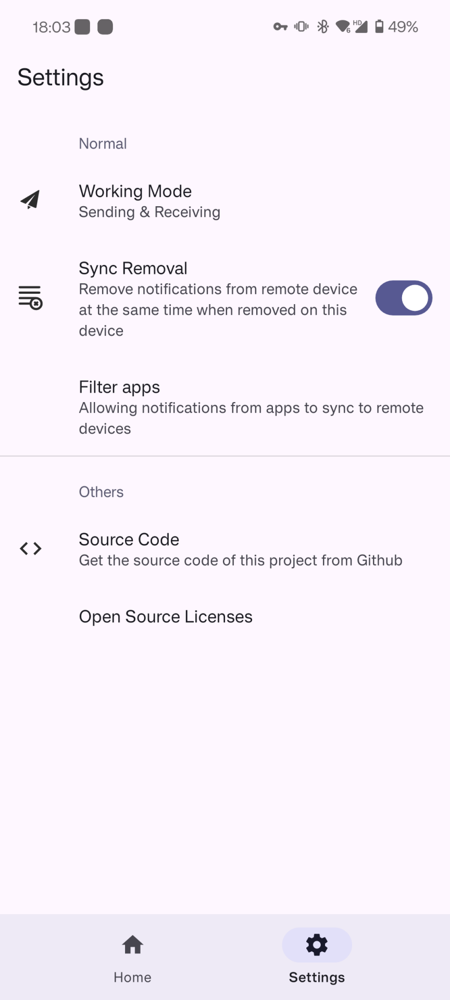

# NotiSync

[简体中文](README.MD) | English

Sync notifications to another devices via Bluetooth Low Energy (a.k.a. BLE)

## About

Sometimes when I hang out, I always take two of my phones together, one held in hand and another in my bag, causing me missed my notifications once in a while; or, when you need your phone, which is far away from you, to receive a verification code, you're too lazy to get that phone (yes include me). In these cases, you can use this app to sync your notification across devices.

Q: Why not using the [SmsForwarder](https://github.com/pppscn/SmsForwarder)?

A: I used to think I could use this app, but it needs network connection, and currently not supports BLE (see this [issue](https://github.com/pppscn/SmsForwarder/issues/450)).

## Features

+ Post notifications synchronously
+ Remove notifications synchronously
+ Connect to mutiple devices
+ No network usage, not even declaring network permission, keep safe
+ Filter notifications by app

## Notice

Currently it's no more than a demo, many many functions are incomplete, and buggy. I'll get this app done during my daily driver.

## Stargazers over time (Seriously?)

## Screenshots

|  | |
| -- | -- |